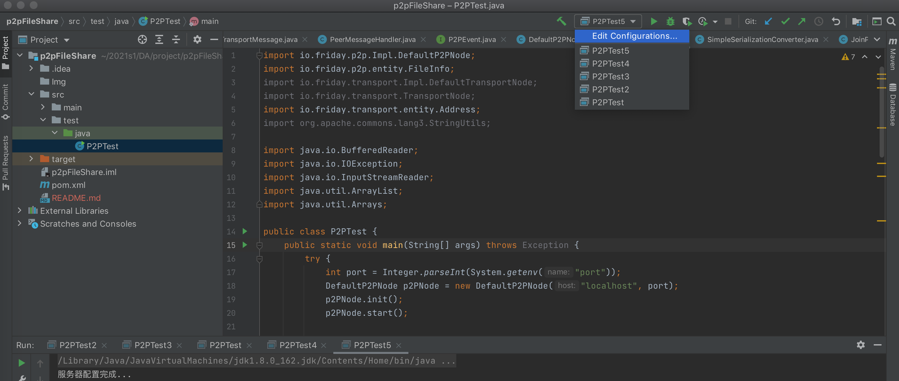
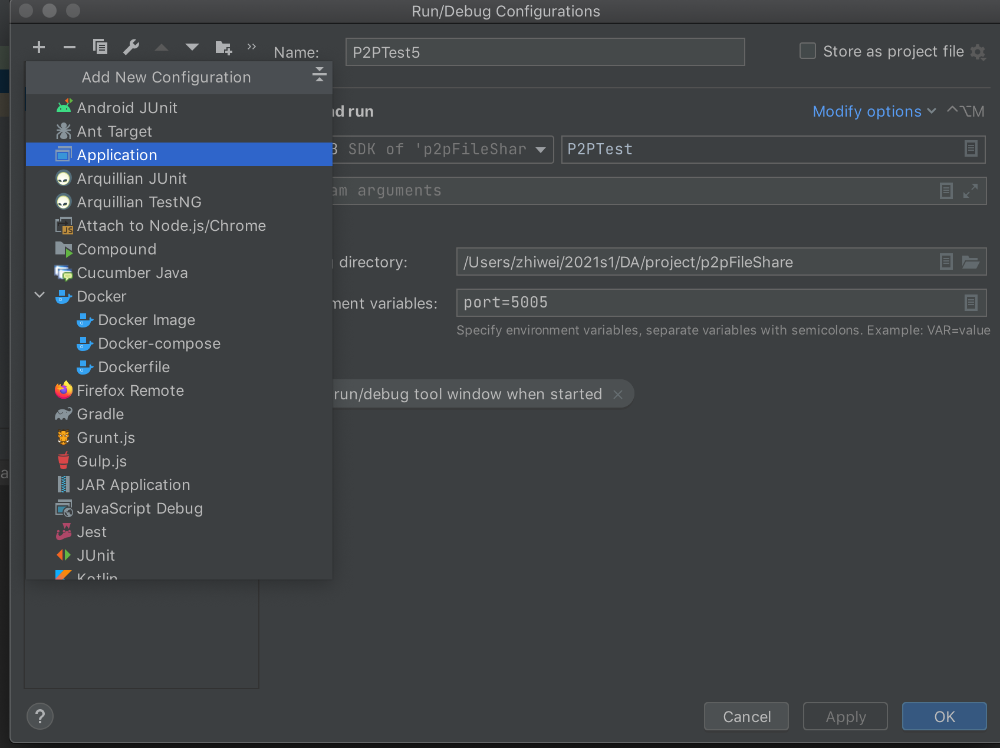
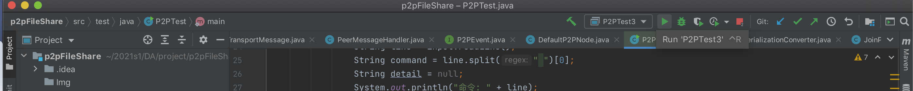
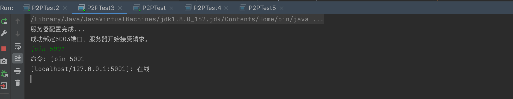
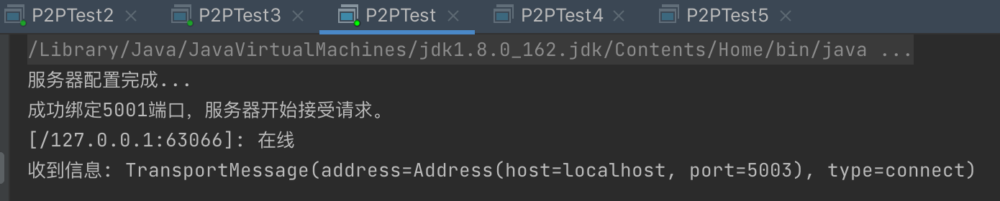

## 启动方法

1. 使用idea加载项目

2. 选择Edit Configuration

   

3. 选择application

   

4. 设置Main Class为P2PTest和修改环境变量为port=<端口>，端口即为当前节点的使用端口，建议端口大于5000

5. 可以通过创建多个相同Application并设置不同port=<端口>的方式，开启多个节点。

## 操作多个节点

1. Run多个设置好的Application

   

2. 当显示：成功绑定5003端口，服务器开始接受请求。在命令行中输入命令

3. 输入join 5001

   

4. 5001应显示被连接

   

5. 同样的方式输入命令，当前支持

6. | 命令                        | 描述                                                         |
   | --------------------------- | ------------------------------------------------------------ |
   | join <port> 例如：join 5001 | 加入端口5001的对应网络                                       |
   | share bbb                   | 分享本节点拥有文件bbb到网络中，并不需要分享真实的文件。      |
   | leave                       | 退出网络（未测试）                                           |
   | list                        | 打印当前节点拥有的信息，邻居信息和自身了解到网络中的文件分享信息 |